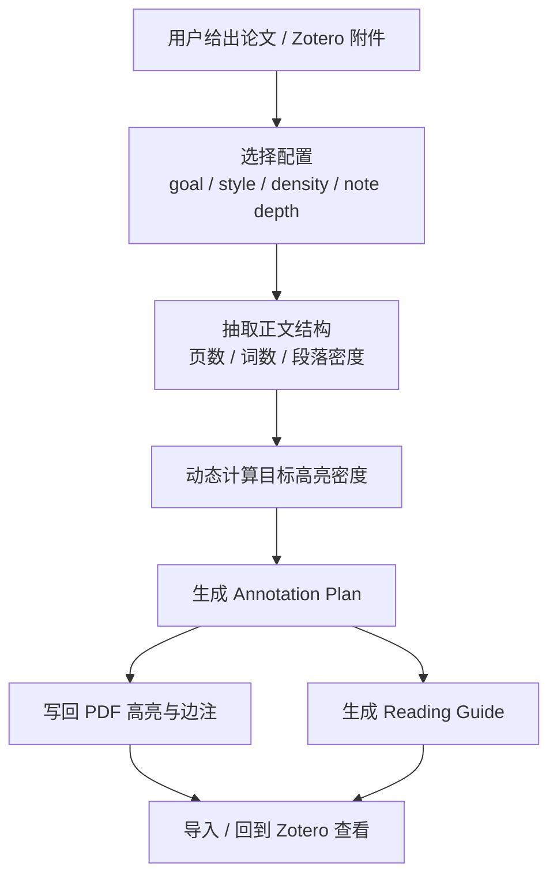

# 🧠 Zotero Paper Coach

一个面向 OpenClaw 的论文阅读教练技能：用于给学术论文和 Zotero 本地 PDF 附件添加**结构化高亮、导师式边注、阅读导图、标注计划**，并支持**按正文页数 / 词数 / 段落密度动态控制标注密度**。

## 🚀 安装（给 AI 直接贴这句）

```text
帮我安装 Zotero Paper Coach：https://raw.githubusercontent.com/RZX00/zotero-paper-coach/main/docs/install.md
```

仓库地址：`RZX00/zotero-paper-coach`  
分支：`main`

## ✨ 它是干什么的

`zotero-paper-coach` **不是**一个无脑自动高亮器。

它更像：

- **论文阅读教练**
- **PDF / Zotero 附件回写标注器**
- **阅读导图生成器**
- **annotation plan 规划器**

核心思路：

- 按用户目标决定标什么，而不是见句就划
- 用稳定颜色语义表达不同类型的信息
- 密度不是拍脑袋，而是按文档本身动态计算
- 边注要真能帮人读懂，不是“important”这种废话
- 对 Zotero 工作流保持诚实：能改 PDF 附件就说改 PDF 附件，不假装自己是原生数据库注释系统

## 🗺️ 流程图



## 🛠️ 主要能力

### 1）目标导向标注

支持这些阅读目标：

- `beginner-learning` 入门理解
- `quick-read` 快速抓重点
- `exam-prep` 备考 / 课程
- `literature-review` 文献综述
- `replication` 复现实验
- `citation-harvest` 提取可引用观点

### 2）风格切换

支持这些标注风格：

- `mentor` 导师型
- `top-student` 学霸型
- `critical-researcher` 批判型研究员
- `executive-brief` 极简摘要官

### 3）密度控制

支持这些密度档位：

- `light`
- `medium`
- `heavy`
- `teaching`

并且密度不是固定总数，而是综合这些信号动态估计：

- 正文页数
- 正文字数
- 段落密度
- 论文类型（哲学 / 理论文 / 图表型论文等）

### 4）副产物输出

除了写 PDF，还会生成：

- `paper.reading-guide.md`
- `paper.annotation-plan.md`
- `paper.annotation-plan.json`

### 5）Zotero 友好

- 支持 Zotero 本地 PDF 附件工作流
- 提供稳定的 Zotero 导入脚本
- 避开 macOS 上不稳定的 `open -a Zotero file.pdf` 路线

## 📁 目录结构

```text
zotero-paper-coach/
├── SKILL.md
├── references/
│   ├── annotation-plan-schema.md
│   ├── annotation-styles.md
│   ├── backend-modes.md
│   ├── density-profiles.md
│   ├── failure-and-fallbacks.md
│   ├── reading-goals.md
│   ├── user-modes.md
│   └── zotero-import-workflow.md
└── scripts/
    ├── annotate_pdf.py
    ├── extract_pdf_outline.py
    ├── import_pdf_to_zotero.py
    └── remove_openclaw_annots.py
```

## 📦 手动安装

把 `zotero-paper-coach/` 整个目录放到以下任一位置：

- `<workspace>/skills/zotero-paper-coach`
- `~/.openclaw/skills/zotero-paper-coach`

然后重新开启一个新的 OpenClaw session，让技能被重新加载。

## ⚙️ 运行时依赖

安装 skill 文件本身不要求自动改系统。

但实际运行某些流程时，通常会用到：

- Python 3
- PyMuPDF / `fitz`
- Zotero Desktop（如果你要走 Zotero 查看/导入流程）

## 🎯 这个 skill 的立场

它有明确偏向：

- 高亮不是越多越好，但“密”也不能靠嘴说
- 密度看的是**高亮锚点覆盖**，不是“高亮+边注总数”自我感动
- 真正有价值的是 annotation plan 和阅读导图
- 产品诚实比魔法感重要

## 📚 仓库内容

这个仓库是按“可直接 GitHub 分发 + 可通过提示词安装”来组织的：

- `zotero-paper-coach/` — 可安装的 AgentSkill 目录
- `docs/install.md` — 给 AI agent 看的安装说明
- `PROMPT_TEMPLATE.txt` — 可直接复制的安装提示词
- `zotero-paper-coach.skill` — 已打包好的 skill 文件

## ✅ 当前状态

当前是**已验证可运行的原型**，已经拿真实论文跑过：

- Transformer 风格技术论文
- 哲学 / 诠释学理论论文

## 📄 License

本项目采用 **MIT License**。详见 [`LICENSE`](./LICENSE)。